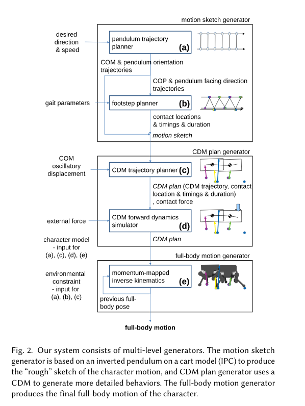

# Spot Controller in Webots

# Motion and Trajectory Planning 

### Pendulum Trajectory Planner:
Models robot with Inverted Pendulum Cart (IPC).

LQR finds the horizontal force applied to the IPC to meet desired speed/direction, 
the output is Center of Mass,
Center of Pressure,
and pendulum orientation trajectories.

Where
is the quaternions algebra.

Note: the IPC is constructed such that the COM and position of the pendulum match the COM and COP of the 
robot model.

### Footstep location/timing planner(The area to change):
The input of the planner is the output of the IPC model above.

The location/timings are determined by 
this is done by sampling the trajectory of the cart, .

The actual location is had by transforming the sample location by the user-defined foot transform, which is composed of the 
lateral translation and the rotation about a vertical axis from the cart to the foot.

They also optimize the locations/timings so that they're more "natural".
The input to this optimization are gait parameters: desired stride length and duration, desired step length and duration, desired
ration between contact phases, and foot offset transformation.

# References: 
Fast and Flexible Multilegged Locomotion Using Learned Centroidal Dynamics

# Notes:
Could do STOMP to find arm trajectories:
    How to find WHERE to put each foot?
        Keep track of center of mass, from there we can try and find two foot locations that will stabalize and center the mass.

        Idea:
            If Spot is off balance, take path plan and try and find stabalizing spots for the feet with the least weight on them first. 
            This doesn't catch the case where you need to move one of the heavier legs to stabalize, e.g. both of spot's right legs are in the 
            air, and the bot is falling over to the left, no possible ways to move the two right legs to stabalize, must move of the the ones in contact with the ground.
            Could maybe catch thiss with constraints?

    How to find footholds while walking?
        Learning: 
        - RL model, use path planning to actually move feet.
        Control:
        - Surface normals, friction coeff,  want to favor those that are pointing straight up, 

